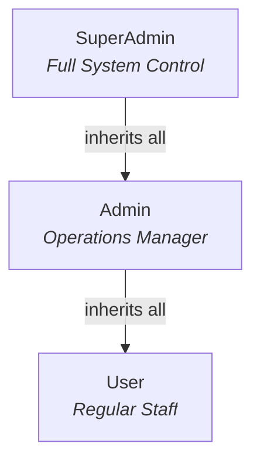
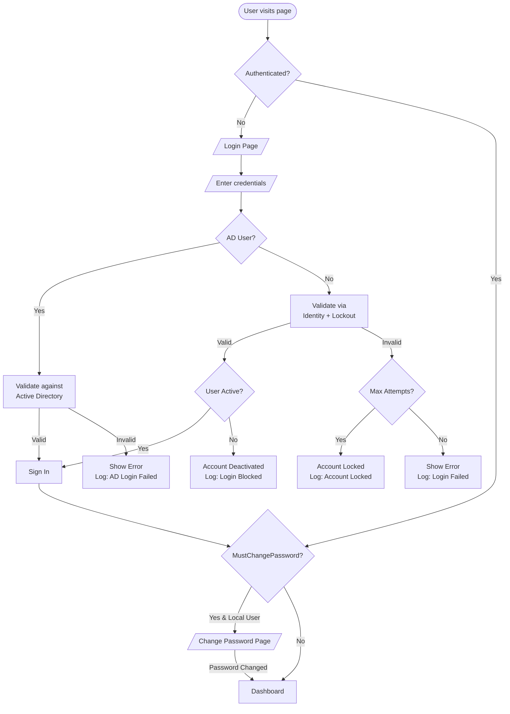
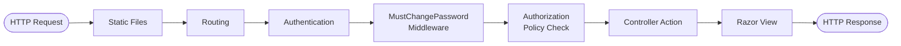
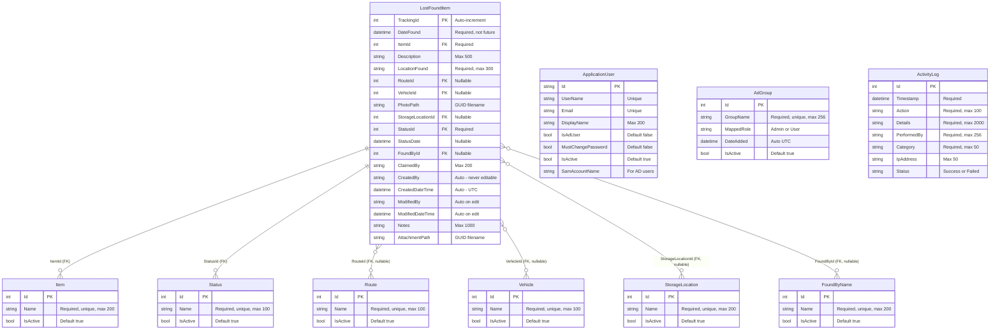
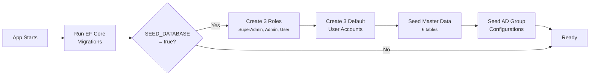

<div align="center">

# Lost & Found Application

**A full-featured, enterprise-grade Lost & Found management system built for local Windows deployment.**


Track, manage, and report on lost & found items with role-based access control, Active Directory integration, file uploads, full audit logging, and more — all running **100% locally** on your own Windows hardware.

[Getting Started](#getting-started) · [User Roles](#user-roles) · [Features](#feature-overview) · [Architecture](#architecture) · [Configuration](#configuration--environment)

</div>

---

## Table of Contents

- [Getting Started](#getting-started)
  - [Prerequisites](#prerequisites)
  - [Step 1: Download & Extract](#step-1-download--extract-the-project)
  - [Step 2: Open in Visual Studio](#step-2-open-the-project-in-visual-studio)
  - [Step 3: Configure MSSQL](#step-3-configure-your-mssql-connection)
  - [Step 4: Run the App](#step-4-run-the-application)
  - [Step 5: Automation](#step-5-system-automation-the-magic)
  - [Step 6: Access the App](#step-6-accessing-the-app)
  - [Troubleshooting](#troubleshooting-quick-check)
- [User Roles](#user-roles)
- [Feature Overview](#feature-overview)
- [Architecture](#architecture)
- [Database Schema](#database-schema)
- [Authentication & Security](#authentication--security)
- [API / Route Reference](#api--route-reference)
- [Services & Business Logic](#services--business-logic)
- [Frontend Architecture](#frontend-architecture)
- [Configuration & Environment](#configuration--environment)
- [Project File Structure](#project-file-structure)

---

## Getting Started

### Prerequisites

Before you begin, ensure your Windows machine has the following:

| # | Software | Notes |
|---|----------|-------|
| 1 | **Visual Studio 2022** (Community, Professional, or Enterprise) | Must include the **"ASP.NET and web development"** workload |
| 2 | **.NET 8.0 SDK** | Usually installed automatically with VS 2022 |
| 3 | **Microsoft SQL Server** (Local) | SQL Server 2022 Express or LocalDB — ensure the service is **running** |

---

### Step 1: Download & Extract the Project

If you are downloading the source code directly from GitHub as a ZIP file:

1. Click the green **"<> Code"** button on the repository page.
2. Select **"Download ZIP"** and save it (e.g., to your `Downloads` folder).
3. ** Windows Security Step:**
 - Right-click the `.zip` file → **Properties**
 - If you see *"This file came from another computer and might be blocked..."*, check the **Unblock** box → **Apply** → **OK**
4. Right-click the `.zip` file → **Extract All...** → Choose a destination (e.g., `C:\Projects\LostAndFound`).

---

### Step 2: Open the Project in Visual Studio

1. Navigate to the extracted folder in File Explorer.
2. Double-click **`LostAndFoundApp.csproj`** (or `.sln` if present) — Visual Studio 2022 will launch.
3. Wait while Visual Studio automatically restores NuGet packages (watch the "Output" window at the bottom).

---

### Step 3: Configure Your MSSQL Connection

1. In **Solution Explorer** (right panel), open **`appsettings.json`**.
2. Find the `ConnectionStrings` section at the top:
 ```json
 "ConnectionStrings": {
 "DefaultConnection": "Server=.\\SQLEXPRESS;Database=LostAndFoundDb;Trusted_Connection=True;TrustServerCertificate=True;"
 }
 ```
3. **Most local installs use `.\SQLEXPRESS`**. If you use LocalDB, change to `(localdb)\\MSSQLLocalDB`.
 - `Trusted_Connection=True` uses your Windows login — no separate DB password needed!

---

### ▶ Step 4: Run the Application

1. In the top toolbar, click the dropdown next to the green **Play** button.
2. Select **"http"**, **"https"**, or **"LostAndFoundApp"** (avoid "IIS Express").
3. Click **▶ Play** (or press **F5**).

---

### Step 5: System Automation (The Magic)

On first run, the app automatically:

| Step | What Happens |
|------|-------------|
| **Database Created** | Connects to your SQL Server and creates `LostAndFoundDb` |
| **Tables Built** | Runs EF Core migrations to generate all required tables |
| **Data Seeded** | Populates default users, roles, statuses, and master data |

> No manual SQL scripts needed — everything is automated!

---

### Step 6: Accessing the App

1. Visual Studio opens your browser to the local address (e.g., `https://localhost:5001`).
2. Log in with one of the default accounts below.
3. Uploaded files are saved to a `SecureStorage/` folder inside your project directory.

---

### Troubleshooting Quick-Check

| Problem | Solution |
|---------|----------|
| App crashes instantly on Play | Verify your MSSQL service is **running** (check SQL Server Configuration Manager or Windows Services) |
| Database Connection Error | Confirm the `Server` name in `appsettings.json` matches your install (e.g., `.\SQLEXPRESS` or `(localdb)\MSSQLLocalDB`) |

---

## User Roles

The application has **three user roles** arranged in a permission hierarchy:



### Default Accounts

> All accounts require a **password change on first login**.

| Role | Username | Password | Description |
|:----:|----------|----------|-------------|
| **SuperAdmin** | `superadmin` | `SuperAdmin123!` | IT administrator — full system control |
| **Admin** | `admin` | `Admin123!` | Supervisor / team lead — day-to-day operations |
| **User** | `user` | `User123!` | Regular staff — registers and edits items |

---

### SuperAdmin — Complete System Control

<table>
<tr><td>

**What SuperAdmin can do:**
- **User Management** — Create, edit, delete user accounts; assign roles
- **AD Synchronization** — Configure and manage Active Directory integration; sync users from corporate directory
- **Full Dashboard** — View complete system analytics, charts, statistics, user & role distribution
- **Master Data** — Add, edit, delete any master data (items, routes, vehicles, locations, statuses, found by names)
- **All Logs** — View all activity logs, export as CSV, clear logs
- **Delete Records** — Permanently delete lost & found records
- **File Management** — Upload, replace, and view photos/attachments

</td></tr>
</table>

---

### Admin — Day-to-Day Operations

<table>
<tr><td>

**What Admin can do:**
- **Full Dashboard** — Operational analytics, status breakdown, top item types
- **Master Data** — Full CRUD on all master data tables
- **View All Logs** — See activity logs for all users (cannot export or clear)
- **Delete Records** — Permanently delete lost & found records
- **View Users** — See user list (read-only — cannot edit roles or manage accounts)

**What Admin CANNOT do:**
- Cannot create/delete users or change roles
- Cannot access AD Groups synchronization
- Cannot export or clear logs

</td></tr>
</table>

---

### User — Regular Staff

<table>
<tr><td>

**What User can do:**
- **Create Records** — Register new lost & found items with photos & attachments
- **Edit Records** — Update details of any record
- **Search & Print** — Find items with filters, print results
- **Basic Dashboard** — Status summary and 10 recent records
- **My Logs** — View their own activity history

**What User CANNOT do:**
- Cannot delete any records
- Cannot access Master Data management
- Cannot access User Management, AD settings, or other users' logs

</td></tr>
</table>

---

### Role Comparison Matrix

| Feature | SuperAdmin | Admin | User |
|---------|:---:|:---:|:---:|
| View Dashboard (Full Analytics) | Yes | Yes | Basic |
| Create Lost & Found Records | Yes | Yes | Yes |
| Edit Any Record | Yes | Yes | Yes |
| Delete Records | Yes | Yes | No |
| Manage Master Data | Yes | Yes | No |
| Inline AJAX Master Data Creation | Yes | Yes | No |
| View All Activity Logs | Yes | Yes | No |
| View Own Activity Logs | Yes | Yes | Yes |
| Export Logs (CSV) | Yes | No | No |
| Clear All Logs | Yes | No | No |
| View User List | Yes | Read-only | No |
| Create / Edit / Delete Users | Yes | No | No |
| Change User Roles | Yes | No | No |
| Activate / Deactivate Users | Yes | No | No |
| Manage AD Groups | Yes | No | No |
| Trigger AD Sync | Yes | No | No |

---

## Feature Overview

| Module | Capabilities |
|--------|-------------|
| **Item Management** | Create, Edit, View Details, Delete, Photo Upload, Attachment Upload, Search & Filter, Print Results |
| **Master Data** | Items, Routes, Vehicles, Storage Locations, Statuses, Found By Names, AJAX Inline Create |
| **User Management** | Create Users, Edit Roles, Activate/Deactivate, User List |
| **Active Directory** | AD Group Mapping, Manual Sync, Scheduled Daily Sync, Role Assignment |
| **Activity Logs** | Audit Trail, Filter & Search, CSV Export, Clear Logs |
| **Security** | Role-Based Auth, Password Policy, Account Lockout, CSRF Protection, File Validation |
| **Dashboard** | Status Cards, Recent Records, Analytics Charts, Top Items |

### Feature Details

<details>
<summary><b> Lost & Found Item Management</b></summary>

| Feature | Route | Access |
|---------|-------|--------|
| **Create Record** | `GET/POST /LostFoundItem/Create` | All Users |
| **View Details** | `GET /LostFoundItem/Details/{id}` | All Users |
| **Edit Record** | `GET/POST /LostFoundItem/Edit/{id}` | All Users |
| **Delete Record** | `POST /LostFoundItem/Delete/{id}` | Admin+ only |
| **Search / Filter** | `GET /LostFoundItem/Search` | All Users |
| **Print Results** | `GET /LostFoundItem/PrintSearch` | All Users |
| **View Photo** | `GET /LostFoundItem/Photo/{name}` | All Users |
| **Download Attachment** | `GET /LostFoundItem/Attachment/{name}` | All Users |

**Create/Edit Form Fields:**
Date Found · Item Type (dropdown) · Description · Location Found · Route # · Vehicle # · Storage Location · Status · Status Date · Found By · Claimed By · Notes · Photo Upload · Attachment Upload

**Upload Rules:**
- Photos: `.jpg`, `.jpeg`, `.png`, `.gif` — max 10MB
- Attachments: `.pdf`, `.doc`, `.docx`, `.xls`, `.xlsx`, `.txt`, `.jpg`, `.jpeg`, `.png` — max 10MB
- Total form size: 15MB
- Files renamed to GUIDs, stored outside web root, served through authenticated endpoints only

**Search Features:**
- 9 filter fields (Tracking ID, dates, item, status, route, vehicle, storage, found by)
- Sortable columns (ascending / descending)
- 25 records per page with pagination
- Print view with all results (no pagination)
- Human-readable filter summary

</details>

<details>
<summary><b> Master Data Management</b></summary>

Six master data tables, each with identical CRUD operations:

| Table | Purpose | Name Max Length |
|-------|---------|:---:|
| **Items** | Types of lost/found items (Wallet, Phone, Keys…) | 200 |
| **Routes** | Route numbers for transit context | 100 |
| **Vehicles** | Vehicle numbers/identifiers | 100 |
| **Storage Locations** | Physical locations where items are stored | 200 |
| **Statuses** | Item statuses (Found, Claimed, Stored, Disposed, Transferred) | 100 |
| **Found By Names** | Names of people who found items | 200 |

**Operations per table:** List · Create · Edit · Delete · Toggle Active/Inactive

**In-Use Protection:** Cannot delete entries referenced by existing items — must deactivate instead.

**AJAX Inline Creation:** Admin+ can create new master data entries directly from item form dropdowns without leaving the page.

</details>

<details>
<summary><b> User Management</b></summary>

| Operation | Route | Access |
|-----------|-------|--------|
| **View User List** | `GET /UserManagement` | Admin+ (read-only for Admin) |
| **Create User** | `GET/POST /UserManagement/Create` | SuperAdmin only |
| **Edit Role** | `GET/POST /UserManagement/EditRole/{id}` | SuperAdmin only |
| **Toggle Active** | `POST /UserManagement/ToggleActive/{id}` | SuperAdmin only |

- New users have `MustChangePassword = true` (forced change on first login)
- Server-side role whitelist prevents arbitrary role injection
- Cannot deactivate your own account (safety check)

</details>

<details>
<summary><b> Active Directory Integration</b></summary>

| Operation | Route | Access |
|-----------|-------|--------|
| **View AD Groups** | `GET /UserManagement/AdGroups` | SuperAdmin only |
| **Add Group** | `POST /UserManagement/AddAdGroup` | SuperAdmin only |
| **Update Group Role** | `POST /UserManagement/UpdateAdGroupRole` | SuperAdmin only |
| **Toggle Group** | `POST /UserManagement/ToggleAdGroupActive/{id}` | SuperAdmin only |
| **Remove Group** | `POST /UserManagement/RemoveAdGroup/{id}` | SuperAdmin only |
| **Sync Now** | `POST /UserManagement/SyncNow` | SuperAdmin only |

**Sync Engine Behavior:**
1. Reads all active `AdGroup` configurations
2. Connects to AD using configured domain, container, and SSL settings
3. Enumerates members of each group (recursive)
4. Creates new users / updates existing / deactivates removed
5. Role priority: Admin > User (highest wins if user is in multiple groups)
6. AD groups can only map to Admin or User — **never SuperAdmin** (security design)

**Safety:** If any AD group fails to process, user deactivation is skipped entirely to prevent false deactivations.

**Background Service:** `AdSyncHostedService` runs sync daily at a configurable hour (default: 2 AM UTC). On failure, retries in 1 hour.

</details>

<details>
<summary><b> Activity Logs & Audit Trail</b></summary>

| Operation | Route | Access |
|-----------|-------|--------|
| **View Logs** | `GET /Logs` | All (Users see own only; Admin+ see all) |
| **Export CSV** | `GET /Logs/Export` | SuperAdmin only |
| **Clear All Logs** | `POST /Logs/Clear` | SuperAdmin only |

**Log Categories:** `Auth` · `ADSync` · `UserManagement` · `MasterData` · `Items` · `System`

**Every log entry records:** Timestamp · Action · Details · Performed By · Category · IP Address · Status (Success/Failed)

**CSV Export Security:** Values starting with `=`, `+`, `-`, `@` are prefixed with `'` to prevent formula injection in Excel.

</details>

<details>
<summary><b> Dashboard</b></summary>

**All Roles see:**
- Status summary cards (Total, Found, Claimed, Stored, Disposed, Transferred)
- Recent records table (10 for Users, 15 for Admin/SuperAdmin)

**Admin + SuperAdmin additionally see:**
- User statistics (Total, Active, Inactive, Local, AD users)
- Role distribution (SuperAdmin / Admin / User counts)
- Time-based stats (Items This Week, This Month, Unclaimed 30+ Days)
- Master data counts (all 6 tables)
- Items awaiting action (Found + Stored)
- Status breakdown with percentages
- Top 5 most frequently found item types

</details>

---

## Architecture

### High-Level Architecture

```
                        +---------------------------+
                        |     Browser (Client)      |
                        |  Razor Views + CSS + JS   |
                        +------------+--------------+
                                     | HTTP
                           +------------v--------------+
                        | ASP.NET Core 8.0 MVC App      |
                        |                               |
                        |  Middleware                   |
                        |  (MustChangePassword)         |
                        |         |                     |
                        |  Controllers ----------+      |
                        |  - Account     Services |     |
                        |  - Home        - ActivityLog  |
                        |  - Logs        - FileService  |
                        |  - LostFound   - AdSync       |
                        |  - MasterData  - AdSync       |
                        |  - UserMgmt    (Hosted)       |
                        |         |        |            |
                        |  Security Layer               |
                        |  - Identity                   |
                        |  - Auth Policies              |
                        |  - Anti-Forgery               |
                        +-----+----------+----------+
                              |          |
                +-------------v--+  +----v-----------+
                |  Data Layer    |  | File Storage   |
                |  EF Core 8.0   |  | SecureStorage/ |
                |  SQL Server    |  |  Photos/       |
                |  LostAndFoundDb|  |  Attachments/  |
                +----------------+  +----------------+
                                          |
                              +-----------v----------+
                              | Active Directory     |
                              | (Optional, LDAP)     |
                              +----------------------+
```

### Authentication Flow



### Request Pipeline



### Tech Stack

| Component | Technology | Version |
|-----------|-----------|:-------:|
| Framework | ASP.NET Core | 8.0 |
| Language | C# | Latest |
| ORM | Entity Framework Core | 8.0.24 |
| Database | Microsoft SQL Server | Express / LocalDB |
| Identity | ASP.NET Core Identity | 8.0.24 |
| Logging | Serilog | 10.0.0 |
| AD Integration | System.DirectoryServices.AccountManagement | 8.0.0 |
| Frontend | Razor Views + Vanilla CSS + Vanilla JS | — |
| Icons | Bootstrap Icons (CDN) | — |
| Fonts | Google Fonts (Inter) | — |

---

## Database Schema

### Entity Relationship Diagram



### Foreign Key Behavior

| FK Column | Reference | On Delete |
|-----------|-----------|-----------|
| `ItemId` | → `Item` | **Restrict** (cannot delete if in use) |
| `StatusId` | → `Status` | **Restrict** (cannot delete if in use) |
| `RouteId` | → `Route` | **SetNull** (sets to null) |
| `VehicleId` | → `Vehicle` | **SetNull** |
| `StorageLocationId` | → `StorageLocation` | **SetNull** |
| `FoundById` | → `FoundByName` | **SetNull** |

### Database Indexes

| Table | Indexed Columns |
|-------|----------------|
| `LostFoundItem` | `DateFound`, `StatusId` |
| `ActivityLog` | `Timestamp`, `Category`, `PerformedBy` |
| All Master Data tables | `Name` (unique) |
| `AdGroup` | `GroupName` (unique) |

---

## Authentication & Security

### Password Policy

| Rule | Requirement |
|------|:-----------:|
| Minimum Length | 8 characters |
| Require Digit | |
| Require Lowercase | |
| Require Uppercase | |
| Require Special Character | |

### Account Lockout

| Setting | Default |
|---------|:-------:|
| Max Failed Attempts | 5 |
| Lockout Duration | 15 minutes |
| Apply to New Users | |

### Session / Cookie Configuration

| Setting | Value |
|---------|-------|
| Cookie Expiry | 8 hours |
| Sliding Expiration | Yes |
| HttpOnly | Yes |
| SameSite | Lax |
| Secure Policy | SameAsRequest |

### Security Layers

| Layer | Measures |
|-------|----------|
| **CSRF Protection** | `ValidateAntiForgeryToken` on every POST, `RequestVerificationToken` header for AJAX |
| **Input Validation** | Data Annotations (`[Required]`, `[StringLength]`, `[EmailAddress]`), `[NotFutureDate]` custom attribute, Server-side role whitelist, Duplicate name checks |
| **File Upload Security** | Extension whitelist, File size limit (10MB), Double extension detection, GUID renaming, Path traversal prevention, Files outside web root, Authenticated access only |
| **Auth Security** | Password complexity, Account lockout, Forced password change on first login, AD credentials never stored, Deactivated user blocking |
| **Error Handling** | Custom error pages (400, 403, 404, 405, 408, 500, 503), No stack traces in production |

---

## API / Route Reference

<details>
<summary><b> Click to expand full route table</b></summary>

| Action | Method | Route | SA | A | U |
|--------|:------:|-------|:---:|:---:|:---:|
| **Dashboard** | GET | `/` | Full | Full | Basic |
| **Login** | GET/POST | `/Account/Login` | Public | Public | Public |
| **Change Password** | GET/POST | `/Account/ChangePassword` | Yes | Yes | Yes |
| **Logout** | POST | `/Account/Logout` | Yes | Yes | Yes |
| **Access Denied** | GET | `/Account/AccessDenied` | Public | Public | Public |
| **Error Page** | GET | `/Home/Error` | Public | Public | Public |
| | | | | | |
| **Create Record** | GET/POST | `/LostFoundItem/Create` | Yes | Yes | Yes |
| **View Details** | GET | `/LostFoundItem/Details/{id}` | Yes | Yes | Yes |
| **Edit Record** | GET/POST | `/LostFoundItem/Edit/{id}` | Yes | Yes | Yes |
| **Delete Record** | POST | `/LostFoundItem/Delete/{id}` | Yes | Yes | No |
| **Search** | GET | `/LostFoundItem/Search` | Yes | Yes | Yes |
| **Print Search** | GET | `/LostFoundItem/PrintSearch` | Yes | Yes | Yes |
| **View Photo** | GET | `/LostFoundItem/Photo/{name}` | Yes | Yes | Yes |
| **Download Attachment** | GET | `/LostFoundItem/Attachment/{name}` | Yes | Yes | Yes |
| | | | | | |
| **List Master Data** | GET | `/MasterData/{Table}` | Yes | Yes | No |
| **Create Master Data** | GET/POST | `/MasterData/Create{Entity}` | Yes | Yes | No |
| **Edit Master Data** | GET/POST | `/MasterData/Edit{Entity}/{id}` | Yes | Yes | No |
| **Delete Master Data** | POST | `/MasterData/Delete{Entity}/{id}` | Yes | Yes | No |
| **Toggle Master Data** | POST | `/MasterData/Toggle{Entity}Active/{id}` | Yes | Yes | No |
| **AJAX Create** | POST | `/MasterData/Add{Entity}Ajax` | Yes | Yes | No |
| | | | | | |
| **User List** | GET | `/UserManagement` | Yes | Read-only | No |
| **Create User** | GET/POST | `/UserManagement/Create` | Yes | No | No |
| **Edit User Role** | GET/POST | `/UserManagement/EditRole/{id}` | Yes | No | No |
| **Toggle User Active** | POST | `/UserManagement/ToggleActive/{id}` | Yes | No | No |
| | | | | | |
| **AD Groups** | GET | `/UserManagement/AdGroups` | Yes | No | No |
| **Add AD Group** | POST | `/UserManagement/AddAdGroup` | Yes | No | No |
| **Update AD Role** | POST | `/UserManagement/UpdateAdGroupRole` | Yes | No | No |
| **Toggle AD Group** | POST | `/UserManagement/ToggleAdGroupActive/{id}` | Yes | No | No |
| **Remove AD Group** | POST | `/UserManagement/RemoveAdGroup/{id}` | Yes | No | No |
| **Sync Now** | POST | `/UserManagement/SyncNow` | Yes | No | No |
| | | | | | |
| **View Logs** | GET | `/Logs` | All | All | Own |
| **Export Logs** | GET | `/Logs/Export` | Yes | No | No |
| **Clear Logs** | POST | `/Logs/Clear` | Yes | No | No |

> Public = No auth required · Read-only = Can view but not modify · Own = Own records only

</details>

---

## Services & Business Logic

### Service Architecture

| Service | Used By | Purpose |
|---------|---------|--------|
| **ActivityLogService** | All Controllers | Audit trail for all actions |
| **FileService** | LostFoundItemController | Upload, download, delete photos & attachments |
| **AdSyncService** | UserManagementController | AD credential validation + user synchronization |
| **AdSyncHostedService** | Background (daily) | Scheduled automatic AD sync |

<details>
<summary><b> ActivityLogService — Details</b></summary>

| Method | Description |
|--------|-------------|
| `LogAsync(action, details, performedBy, category, ipAddress?, status)` | Core logging — writes to `ActivityLogs` table |
| `LogAsync(httpContext, action, details, category, status)` | Auto-extracts username and IP from HttpContext |
| `ClearAllLogsAsync()` | Bulk-deletes all logs; returns count |

- **Resilient:** Logging failures are caught and logged to Serilog — never crash the parent operation
- **Truncation:** Details auto-truncated to 2,000 characters

</details>

<details>
<summary><b> FileService — Details</b></summary>

| Method | Description |
|--------|-------------|
| `SavePhotoAsync(IFormFile)` | Validate & save photo; returns GUID filename or null |
| `SaveAttachmentAsync(IFormFile)` | Validate & save attachment; returns GUID filename or null |
| `GetPhoto(fileName)` | Returns FileStream + ContentType |
| `GetAttachment(fileName)` | Returns FileStream + ContentType |
| `DeletePhoto(fileName?)` | Deletes photo from disk (safe for null) |
| `DeleteAttachment(fileName?)` | Deletes attachment from disk (safe for null) |

**8-Layer Security:**
1. File size validation (configurable, default 10MB)
2. Extension whitelist
3. Double extension detection (rejects `malware.exe.jpg`)
4. GUID-based renaming
5. `Path.GetFileName()` strips directory components
6. `StartsWith` path containment check
7. Files stored outside web root
8. Served only through authenticated controller actions

</details>

<details>
<summary><b> AdSyncService — Details</b></summary>

| Method | Description |
|--------|-------------|
| `ValidateAdCredentials(username, password)` | Real-time AD validation at login — credentials never stored |
| `SyncUsersAsync()` | Full sync: create, update, deactivate users |

**Role priority:** Admin (2) > User (1) — highest wins if in multiple groups 
**AD groups can ONLY map to Admin or User — never SuperAdmin**

</details>

---

## Frontend Architecture

| Asset | Technology | Size |
|-------|-----------|:----:|
| `wwwroot/css/site.css` | Custom design system (no framework) | 27 KB |
| `wwwroot/js/site.js` | Vanilla JavaScript | 4 KB |
| Fonts | Google Fonts — Inter (300–800) | CDN |
| Icons | Bootstrap Icons | CDN |

### Razor Views (35 total)

| Folder | Views | Purpose |
|--------|:-----:|---------|
| `Account/` | 3 | Login, ChangePassword, AccessDenied |
| `Home/` | 2 | Dashboard, Error |
| `Logs/` | 1 | Activity logs with filters |
| `LostFoundItem/` | 5 | Create, Details, Edit, Search, PrintSearch |
| `MasterData/` | 18 | 3 views × 6 tables (List, Create, Edit) |
| `UserManagement/` | 4 | UserList, CreateUser, EditRole, AdGroups |
| `Shared/` | 1 | _Layout.cshtml |
| Root | 2 | _ViewImports, _ViewStart |

### Layout Features
- Responsive navbar with role-conditional menu items
- User avatar initial + username display
- Toast notifications via `TempData` (success/error)
- Per-page styles (`@RenderSection("Styles")`) and scripts (`@RenderSection("Scripts")`)

---

## Configuration & Environment

### `appsettings.json`

```json
{
 "ConnectionStrings": {
 "DefaultConnection": "Server=.\\SQLEXPRESS;Database=LostAndFoundDb;Trusted_Connection=True;TrustServerCertificate=True;"
 },
 "ActiveDirectory": {
 "Enabled": false,
 "Domain": "corp.lostandfoundapp.com",
 "Container": "DC=corp,DC=lostandfoundapp,DC=com",
 "UseSSL": true,
 "DailySyncHourUtc": 2
 },
 "FileUpload": {
 "PhotoStoragePath": "./SecureStorage/Photos",
 "AttachmentStoragePath": "./SecureStorage/Attachments",
 "MaxFileSizeBytes": 10485760,
 "AllowedPhotoExtensions": [".jpg", ".jpeg", ".png", ".gif"],
 "AllowedAttachmentExtensions": [".pdf", ".doc", ".docx", ".xls", ".xlsx", ".txt", ".jpg", ".jpeg", ".png"]
 },
 "Identity": {
 "MaxFailedAccessAttempts": 5,
 "LockoutMinutes": 15
 }
}
```

### Environment Variables (`.env.example`)

| Variable | Description | Default |
|----------|-------------|:-------:|
| `SEED_DATABASE` | Seed default data on startup | `true` |
| `ASPNETCORE_ENVIRONMENT` | .NET environment | `Development` |
| `ConnectionStrings__DefaultConnection` | Override DB connection string | — |
| `ActiveDirectory__Domain` | AD domain name | — |
| `ActiveDirectory__Container` | AD container DN | — |
| `ActiveDirectory__UseSSL` | Use SSL for AD | — |
| `FileUpload__MaxFileSizeBytes` | Override max file size | — |
| `Identity__MaxFailedAccessAttempts` | Override lockout threshold | — |
| `Identity__LockoutMinutes` | Override lockout duration | — |

### Database Initialization (Automatic on Startup)



---

## Project File Structure

```
LostAndFoundApp/
│
├── Controllers/
│ ├── AccountController.cs (210 lines) — Login, Logout, ChangePassword, AccessDenied
│ ├── HomeController.cs (188 lines) — Dashboard, Error page
│ ├── LogsController.cs (161 lines) — View, Export, Clear activity logs
│ ├── LostFoundItemController.cs (649 lines) — Full CRUD + Search + Print + Files
│ ├── MasterDataController.cs (719 lines) — CRUD for 6 tables + Toggle + AJAX
│ └── UserManagementController.cs (363 lines) — Users + AD Groups + Sync
│
├── Data/
│ ├── ApplicationDbContext.cs (161 lines) — EF Core context + Fluent API
│ └── DbInitializer.cs (224 lines) — Seed roles, users, master data
│
├── Middleware/
│ └── MustChangePasswordMiddleware.cs (103 lines) — Force password change on first login
│
├── Migrations/
│ ├── 20250217...Initial.cs — Initial schema
│ ├── 20250217...Initial.Designer.cs — Migration metadata
│ └── ApplicationDbContextModelSnapshot.cs — Current schema snapshot
│
├── Models/
│ ├── ActivityLog.cs (53 lines) — Audit trail entity
│ ├── AdGroup.cs (35 lines) — AD group configuration
│ ├── ApplicationUser.cs (34 lines) — Extended Identity user
│ ├── ErrorViewModel.cs (50 lines) — Error page model
│ ├── LostFoundItem.cs (121 lines) — Primary tracking entity
│ ├── MasterDataModels.cs (83 lines) — 6 master data entities
│ └── NotFutureDateAttribute.cs (29 lines) — Custom validation attribute
│
├── Services/
│ ├── ActivityLogService.cs (79 lines) — Centralized activity logging
│ ├── AdSyncHostedService.cs (101 lines) — Daily background AD sync
│ ├── AdSyncService.cs (330 lines) — AD validation + user sync
│ └── FileService.cs (181 lines) — Secure file upload/download/delete
│
├── ViewModels/
│ ├── AccountViewModels.cs (40 lines) — Login, ChangePassword
│ ├── DashboardViewModels.cs (73 lines) — Dashboard data models
│ ├── LogViewModels.cs (24 lines) — Log list model
│ ├── LostFoundItemViewModels.cs (221 lines) — Create, Edit, Detail, Search
│ └── UserManagementViewModels.cs (54 lines) — UserList, CreateUser, EditRole
│
├── Views/
│ ├── Account/ (3 views) — Login, ChangePassword, AccessDenied
│ ├── Home/ (2 views) — Dashboard, Error
│ ├── Logs/ (1 view) — Activity logs list
│ ├── LostFoundItem/ (5 views) — Create, Details, Edit, Search, Print
│ ├── MasterData/ (18 views) — 3 views × 6 tables
│ ├── UserManagement/ (4 views) — Users, Create, EditRole, AdGroups
│ ├── Shared/ (1 view) — _Layout.cshtml
│ ├── _ViewImports.cshtml
│ └── _ViewStart.cshtml
│
├── wwwroot/
│ ├── css/site.css (27 KB) — Custom design system
│ └── js/site.js (4 KB) — Interactive behaviors
│
├── Properties/
│ └── launchSettings.json — VS launch profiles
│
├── .gitignore
├── .env.example — Environment template
├── appsettings.json — App configuration
├── LostAndFoundApp.csproj — Project file
├── Program.cs (161 lines) — Entry point, DI, pipeline
└── README.md — This file
```

---

<div align="center">

**~62 files · ~4,600+ lines of C# · 35 Razor Views · 27KB CSS · 4KB JS**

Built with using ASP.NET Core 8.0

</div>
